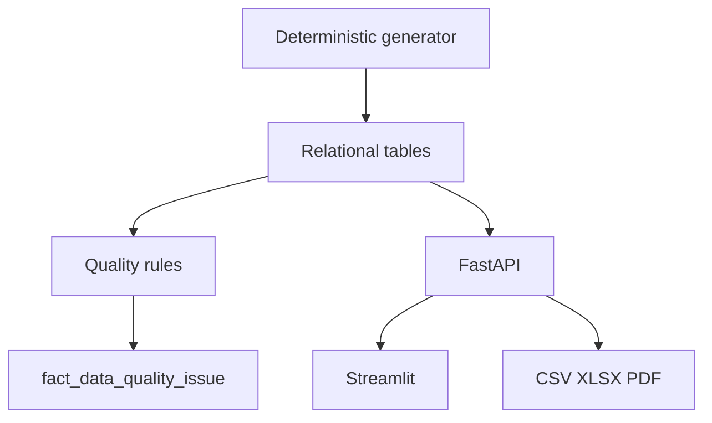

# Architecture

The system follows Generator -> quality validation -> curated relational store -> API -> dashboard/reporting. SQLite is the zero-config fallback; PostgreSQL is provided via Docker Compose. The API is stateless and reads an explicit database path from `DATABASE_URL`.

Operational guardrails: synthetic banner, UTC timestamps, safe preset queries, no arbitrary SQL endpoint, no outbound integrations.
