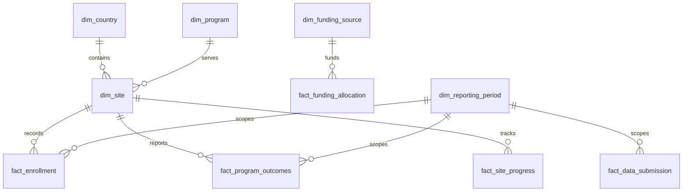

# Data model

Dimensions: country, program, site, indicator, funding source, reporting period. Facts: enrollment, outcomes, site progress, funding allocation, submissions, quality issues, refreshes, ad-hoc requests, migration reconciliation.

All identifiers are synthetic. The generator uses seed 20260923 and produces reproducible rows.
