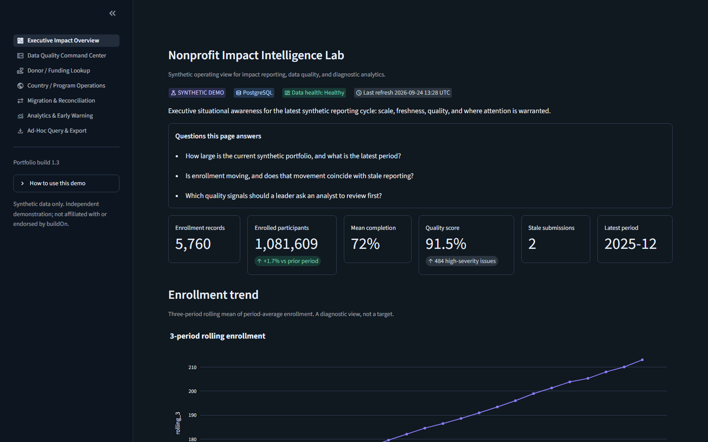
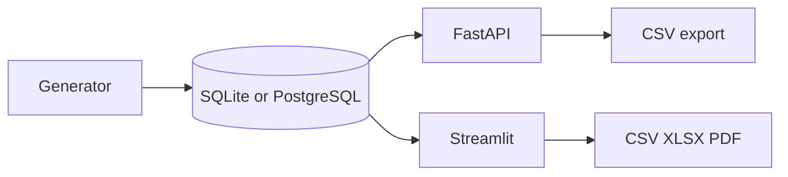
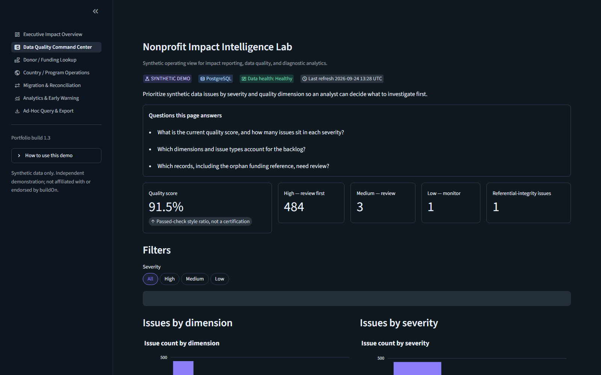
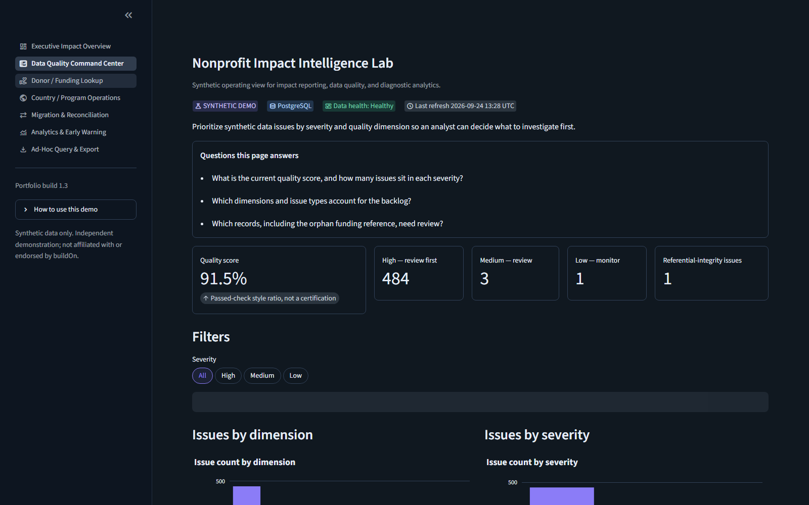
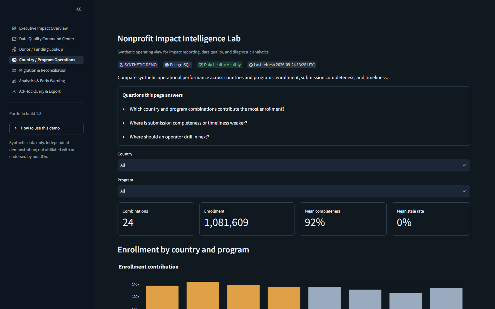
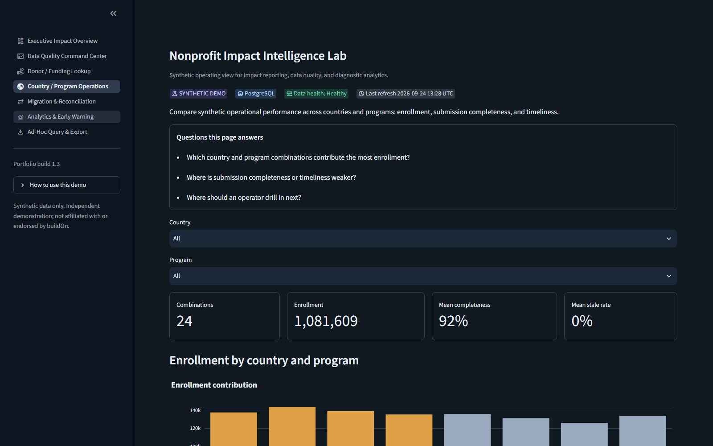
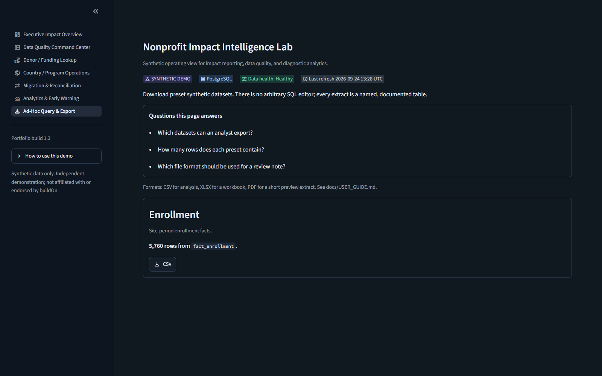

# Nonprofit Impact Intelligence Lab

A local analytics lab that turns a deterministic synthetic impact dataset into quality review, funding lookup, migration readiness, and bounded forecasts.

[](https://github.com/swap2you/nonprofit-impact-intelligence-lab/actions/workflows/ci.yml)


> Independent synthetic demonstration. Not affiliated with or endorsed by buildOn. No confidential or real participant data.



## Why this exists

Impact numbers are often late, incomplete, and hard to reconcile across sites, programs, and funding records. This lab is a concrete local system for that problem: a seeded relational model, a quality ledger, an API, and a seven-page operating view.

## What this demonstrates

- Deterministic synthetic data with planted defects an analyst can find
- PostgreSQL as the demo store, with a SQLite fallback
- Quality dimensions, migration reconciliation, and a bounded forecast
- A FastAPI surface and preset CSV, XLSX, and PDF exports
- Windows one-command startup and GitHub Actions

## Capability matrix

| Capability | In this repo |
|---|---|
| Deterministic synthetic data | Seed `20260923` |
| PostgreSQL 16 | Docker Compose, localhost only |
| SQLite compatibility | Default when `DATABASE_URL` is unset |
| Quality dimensions | Seven dimensions, High / Medium / Low |
| Analytics | Trend, IQR markers, diagnostic notes, bounded forecast |
| API | FastAPI, OpenAPI at `/docs` |
| Dashboards | Seven Streamlit pages |
| Exports | CSV, XLSX, PDF preview |
| Migration reconciliation | Matched, mismatch, rejected |
| CI | SQLite suite, then PostgreSQL suite |
| Windows operations | Setup, start, stop, status, reset, doctor |

## Architecture



## Data scale

Seed `20260923` produces 8 countries, 6 programs, 240 sites, 24 months, 5,760 enrollment facts, 488 quality issues, and **23,745** rows across the seven fact tables counted by `/summary`. Regenerate with `python scripts/generate_data.py`.

## Dashboard gallery

| Executive | Data quality | Funding lookup |
|---|---|---|
|  |  |  |

| Country operations | Migration | Analytics |
|---|---|---|
|  |  |  |



## Data quality

Issues are ledger rows, not a hidden score. Dimensions are completeness, validity, consistency, uniqueness, timeliness, freshness, and referential integrity. Funding record 97 points at `site_id` 999, which is absent from `dim_site`. The quality score is a transparent ratio, not a certification. See [DATA_QUALITY_RULES.md](DATA_QUALITY_RULES.md).

## Analytics

Period means, a three-period rolling average, IQR markers, and a one-period ordinary-least-squares forecast with a residual band. Notes use diagnostic language. They are not causal claims. See [ANALYTICS_METHODS.md](ANALYTICS_METHODS.md).

## Migration

Readiness is matched rows divided by all reconciliation rows. This seed is about 10.8% matched because mismatches and rejections are planted. A low score is the scenario, not an application failure.

## Quick start

First time on Windows:

```powershell
Set-ExecutionPolicy -Scope Process Bypass
.\scripts\windows\Setup-ImpactLab.ps1
.\scripts\windows\Start-ImpactLab.ps1
```

Each day after that:

```powershell
.\scripts\windows\Start-ImpactLab.ps1
```

Dashboard: http://127.0.0.1:8501 · API docs: http://127.0.0.1:8000/docs

### Manual developer run

```powershell
uv venv .venv --python 3.11
uv pip install -r requirements.txt --python .\.venv\Scripts\python.exe
docker compose up -d
$env:DATABASE_URL='postgresql+psycopg2://impact@localhost:5432/impact_lab'
.\.venv\Scripts\python.exe scripts\generate_data.py
.\.venv\Scripts\python.exe -m pytest -q
.\.venv\Scripts\python.exe -m uvicorn api.main:app --host 127.0.0.1 --port 8000
.\.venv\Scripts\python.exe -m streamlit run app/dashboard.py --server.address 127.0.0.1 --server.port 8501
```

Omit `DATABASE_URL` to use SQLite.

## Tests and CI

`pytest` covers the generator, analytics edges, API contracts, and a headless render of all seven pages. [CI](https://github.com/swap2you/nonprofit-impact-intelligence-lab/actions/workflows/ci.yml) runs that suite twice: SQLite, then PostgreSQL 16.

## Documentation

| Guide | Path |
|---|---|
| Documentation index | [docs/README.md](docs/README.md) |
| Windows setup | [docs/GETTING_STARTED_WINDOWS.md](docs/GETTING_STARTED_WINDOWS.md) |
| Daily commands | [docs/DAILY_RUNBOOK.md](docs/DAILY_RUNBOOK.md) |
| User guide | [docs/USER_GUIDE.md](docs/USER_GUIDE.md) |
| Dashboard pages | [docs/DASHBOARD_GUIDE.md](docs/DASHBOARD_GUIDE.md) |
| Developer guide | [docs/DEVELOPER_GUIDE.md](docs/DEVELOPER_GUIDE.md) |
| Architecture | [docs/ARCHITECTURE.md](docs/ARCHITECTURE.md) |
| Data dictionary | [docs/DATA_DICTIONARY.md](docs/DATA_DICTIONARY.md) |
| Security and privacy | [SECURITY_PRIVACY.md](SECURITY_PRIVACY.md) |

## Presentation and guides

- [Executive demo (PowerPoint)](assets/presentation/Nonprofit_Impact_Intelligence_Lab_Executive_Demo.pptx)
- [Executive demo (PDF)](assets/presentation/Nonprofit_Impact_Intelligence_Lab_Executive_Demo.pdf)
- [User guide PDF](assets/guides/Nonprofit_Impact_Intelligence_Lab_User_Guide.pdf)
- [Technical runbook PDF](assets/guides/Nonprofit_Impact_Intelligence_Lab_Technical_Runbook.pdf)

## Security and privacy

Localhost only. Synthetic names and keys. No tokens in the repo. PostgreSQL trust authentication is for this isolated demo and CI, not a production pattern. Details: [SECURITY_PRIVACY.md](SECURITY_PRIVACY.md).

## Limitations

This is a portfolio demonstration, not a production control system. It does not authenticate users, connect to Teams or Slack, or certify data for an external report. Forecasts are illustrative.

## Roadmap

Configurable quality rules, authenticated database access, and optional notification channels are described as future work in [ROADMAP.md](ROADMAP.md). They are not implemented.
