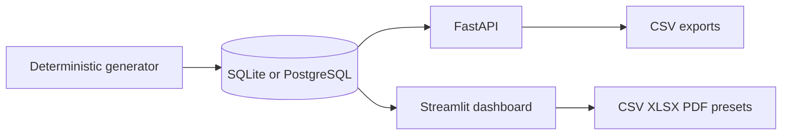
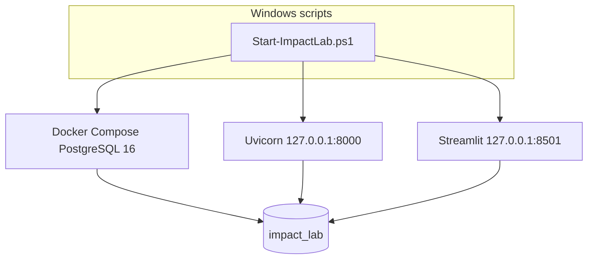

# Architecture

Streamlit and FastAPI read one relational database. The generator is the only writer in this demo.

| Component | Port | Notes |
|---|---|---|
| PostgreSQL | 5432 | localhost only, trust auth for this demo |
| FastAPI | 8000 | stateless reads |
| Streamlit | 8501 | seven pages, preset exports |

SQLite remains the zero-config path when `DATABASE_URL` is unset. There is no arbitrary SQL endpoint.
